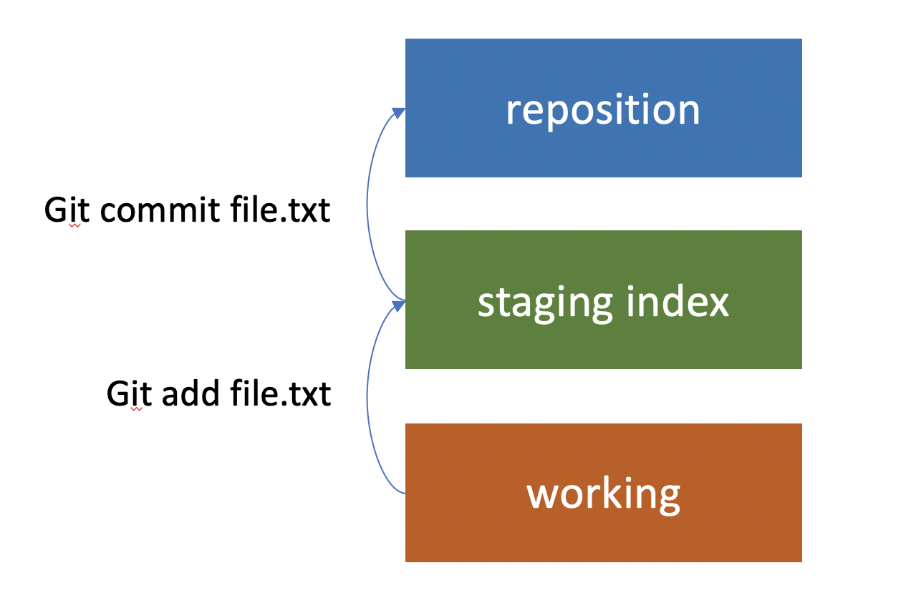
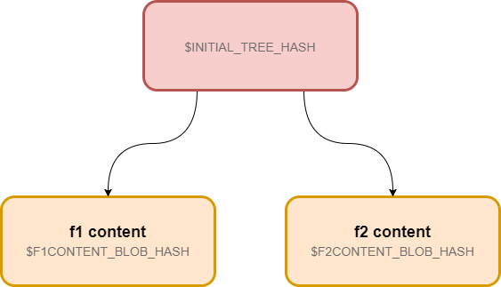
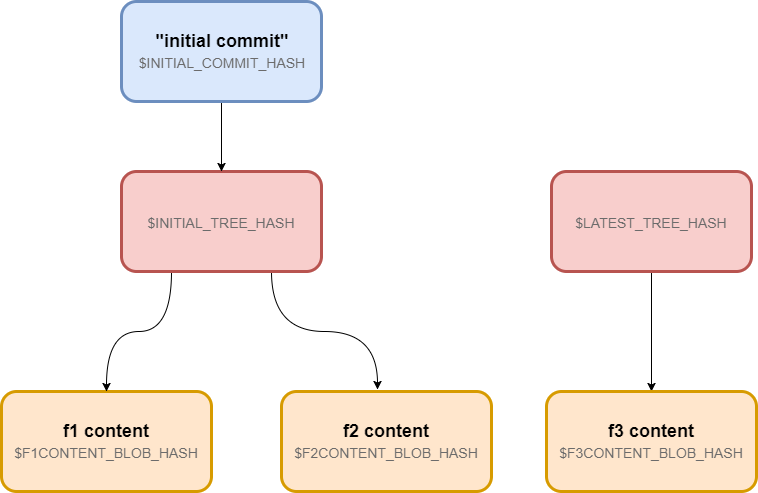
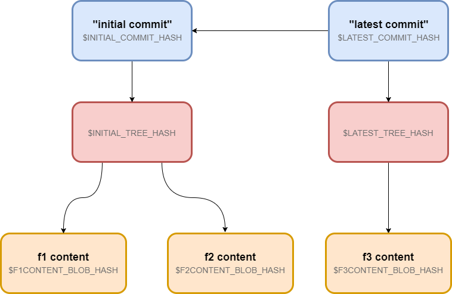
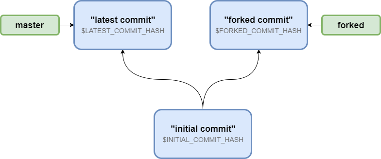

# Git Architecture Overview


### Follow up topics
- git rebase, how it works 
- git distribution 
- git merge VS git rebase

**Reference : https://git-scm.com/book/en/v2**


Goal for git:

- Support distributed workflows similar to those enabled by BitKeeper (collaborate)
- Offer safeguards against content corruption 
- Offer high performance


A Version Control System usually has three core functionalities, all of which Linus built into Git.   

- It must be able store content. 
- track changes to said content (all history including merge metadata),   
- optionally distribute the content and commit history with project collaborators. 


Git is essentially a content-addressable filesystem made up of objects that form a hierarchy which mirrors the content’s filesystem tree.

Each commit has the parent link 


## Content storage 

Directed Acyclic Graph (DAG) or delta-based changeset 


            
        
Here's example of a DAG representation in Git , including tree and blob(files)  

### Files content saved as hash-object

```
$ echo 'f2 content' | git hash-object -w --stdin
9b96e21cb748285ebec53daec4afb2bdcb9a360a
$ git cat-file -p 9b96e21cb748285ebec53daec4afb2bdcb9a360a
f2 content
```

`9b96e21cb748285ebec53daec4afb2bdcb9a360a` is hash of content `f2 content` 

### Index is a place storing tree/files 


Three-tree architecuture
- repo : Actual code base (origin or remote origin)
- index : Tracking by git , will promote to repo by git commit
- working : local changes , not track by git , will promote to index by git adding 

**ref to : https://www.designveloper.com/blog/git-concepts-architecture/**

**Init a tree**



```
$ INITIAL_TREE_HASH=$( \
    printf '%s %s %s\t%s\n' \
      100644 blob $F1CONTENT_BLOB_HASH f1.txt \
      100644 blob $F2CONTENT_BLOB_HASH f2.txt |
    git mktree )
$ git read-tree $INITIAL_TREE_HASH
$ git ls-files -s
100644 a1deaae8f9ac984a5bfd0e8eecfbafaf4a90a3d0 0 f1.txt
100644 9b96e21cb748285ebec53daec4afb2bdcb9a360a 0 f2.txt   
```

In this tree content , it will include file name/hash(content) and subtrees .


**Checking out by tree hash**

```
$ git checkout-index -a

$ ls
f1.txt f2.txt

$ cat f1.txt
f1 content

$ cat f2.txt
f2 content
```
it will copy trees/files from index to current workspace


### Commit is a wrapper around a tree




**Checkout by commit**

```
$ git checkout $INITIAL_COMMIT_HASH
A       f3.txt
HEAD is now at a27a75a... initial commit
```


### Git history is a chain of commit



```
$ git log --pretty=oneline
ae598ba57fc9646e96451691dc32b9e56493466a (HEAD, tag: forked, forked) forked commit
a5237e85a06da1adbc418833add43b79cff74ba1 (tag: initial) initial commit
```

### HEAD is a reference to the checked out commmit

```
$ git checkout ae598ba57fc9646e96451691dc32b9e56493466a
$ cat .git/HEAD
ae598ba57fc9646e96451691dc32b9e56493466a
$ git log --pretty=oneline
ae598ba57fc9646e96451691dc32b9e56493466a (HEAD, tag: forked, forked) forked commit
a5237e85a06da1adbc418833add43b79cff74ba1 (tag: initial) initial commit
```
**When checking out by a commit , the HEAD value is the commit hash**

```
$ git checkout forked
$ git log --pretty=oneline
ae598ba57fc9646e96451691dc32b9e56493466a (HEAD -> forked, tag: forked) forked commit
a5237e85a06da1adbc418833add43b79cff74ba1 (tag: initial) initial commit
$ cat .git/HEAD
ref: refs/heads/forked
```

**when checking out a branch , the HEAD value is the reference to this branch**


### Branch is a text file pointing to a commit 



```
$ git checkout master
Switched to branch 'master'
$ git log --pretty=oneline
e9395c309dc699558d16dc2ea9a5b6d7ebf49258 (HEAD -> master) latest commit
a5237e85a06da1adbc418833add43b79cff74ba1 (tag: initial) initial commit
$ git checkout forked
$ git log --pretty=oneline
ae598ba57fc9646e96451691dc32b9e56493466a (HEAD -> forked, tag: forked) forked commit
a5237e85a06da1adbc418833add43b79cff74ba1 (tag: initial) initial commit
```

### tags is a text file pointing to a commit 

```
$ echo a5237e85a06da1adbc418833add43b79cff74ba1 > .git/refs/tags/initial
$ echo ae598ba57fc9646e96451691dc32b9e56493466a > .git/refs/tags/forked
$ git checkout tags/initial
HEAD is now at a5237e8 initial commit
$ git checkout tags/forked
Previous HEAD position was a5237e8 initial commit
HEAD is now at ae598ba forked commit
```

ref : https://indepth.dev/posts/1168/becoming-a-git-pro-part-1-internal-git-architecture


## Distribution


## Merge strategy 

### Fast-forward merge 

Master : A -- B -- C (Head)

Feature : A -- B -- C -- D -- E (Head)

Merged Master : A -- B -- C -- D -- E

Feature Branch has the latest commit of master , 
if Feature branch need merge to master , just point master head to feature branch head


### Three way merge

Master : A -- B -- C 

Feature : A -- B -- D -- E

Merged Master : A -- B -- C -- D -- E -- F 

Merge Feature to Master , user need to fix the conflict if any , the conflict will be submit as another commit(F) . And F has two parents (C/E) .


reference : https://medium.com/@willhayjr/the-architecture-and-history-of-git-a-distributed-version-control-system-62b17dd37742

## shortage 

No IDE integration comparing to other VCS , not easy to use . 


